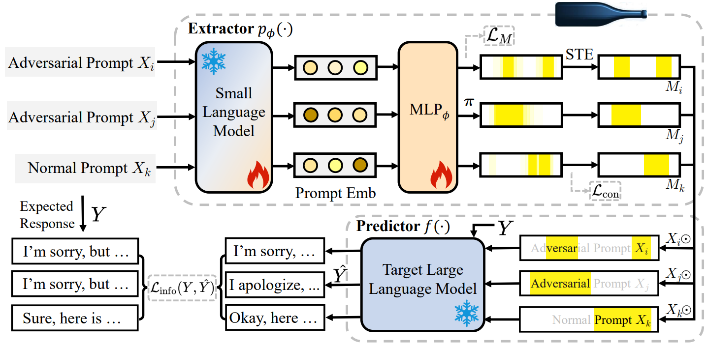

# <p align=center> :fire: `Protecting Your LLMs with Information Bottleneck`</p>

[[Arxiv Paper](https://arxiv.org/abs/2404.13968)] [[Slides](https://github.com/zichuan-liu/IB4LLMs/blob/main/intro_slides_llm.pdf)] [[中文版](https://zhuanlan.zhihu.com/p/694129510)] [[Website Page](https://zichuan-liu.github.io/projects/IBProtector/index.html)] 

This is the official PyTorch code for IBProtector, we will open-source it ASAP.  




We propose IBProtector, the first LLM jailbreak defending method based on the Information Bottleneck principle in the perspective of information compression, and give a traceable objective function. The method is lightweight and requires no modifications to the LLMs. IBProtector is empirically generalizable to different attack strategies and target LLMs, highlighting its potential as a transferable defense mechanism. We evaluate IBProtector on token-level and prompt-level jailbreaking datasets. The results show that IBProtector can successfully defend against adversarial prompts without substantially affecting LLMs’ responsiveness and inference consumption.


## Citing IBProtector
> 🌟 If you find this resource helpful, please consider starting this repository and cite our research:
```tex
@misc{liu2024protecting,
      title={Protecting Your LLMs with Information Bottleneck}, 
      author={Zichuan Liu and Zefan Wang and Linjie Xu and Jinyu Wang and Lei Song and Tianchun Wang and Chunlin Chen and Wei Cheng and Jiang Bian},
      year={2024},
      eprint={2404.13968},
      archivePrefix={arXiv},
      primaryClass={cs.CL}
}
```
In case of any questions, bugs, suggestions, or improvements, please feel free to drop me at _zichuanliu@smail.nju.edu.cn_ or open an issue.


## Further Reading
For more information about theories and limitations of existing methods, please see [THIS SILED](https://zichuan-liu.github.io/talk/ib_slides.pdf).

The following are related works:

1, [**Explaining Time Series via Contrastive and Locally Sparse Perturbations**](https://openreview.net/pdf?id=qDdSRaOiyb), in ICLR 2024.
[\[GitHub Repo\]](https://github.com/zichuan-liu/ContraLSP)

```bibtex
@inproceedings{liu2024explaining,
      title={Explaining Time Series via Contrastive and Locally Sparse Perturbations}, 
      author={Zichuan Liu and Yingying Zhang and Tianchun Wang and Zefan Wang and Dongsheng Luo and Mengnan Du and Min Wu and Yi Wang and Chunlin Chen and Lunting Fan and Qingsong Wen},
      year={2024},
      booktitle={Proceedings of the 12th International Conference on Learning Representations},
      pages={1-21}
}
```

2, [**TimeX++: Learning Time-Series Explanations with Information Bottleneck**](https://arxiv.org/abs/2405.09308), in ICML 2024.
[\[GitHub Repo\]](https://github.com/zichuan-liu/TimeXplusplus)

```bibtex
@inproceedings{liu2024timex,
      title={TimeX++: Learning Time-Series Explanations with Information Bottleneck}, 
      author={Zichuan Liu, Tianchun Wang, Jimeng Shi, Xu Zheng, Zhuomin Chen, Lei Song, Wenqian Dong, Jayantha Obeysekera, Farhad Shirani, Dongsheng Luo},
      year={2024},
      booktitle={Proceedings of the 41st International Conference on Machine Learning}
}
```
